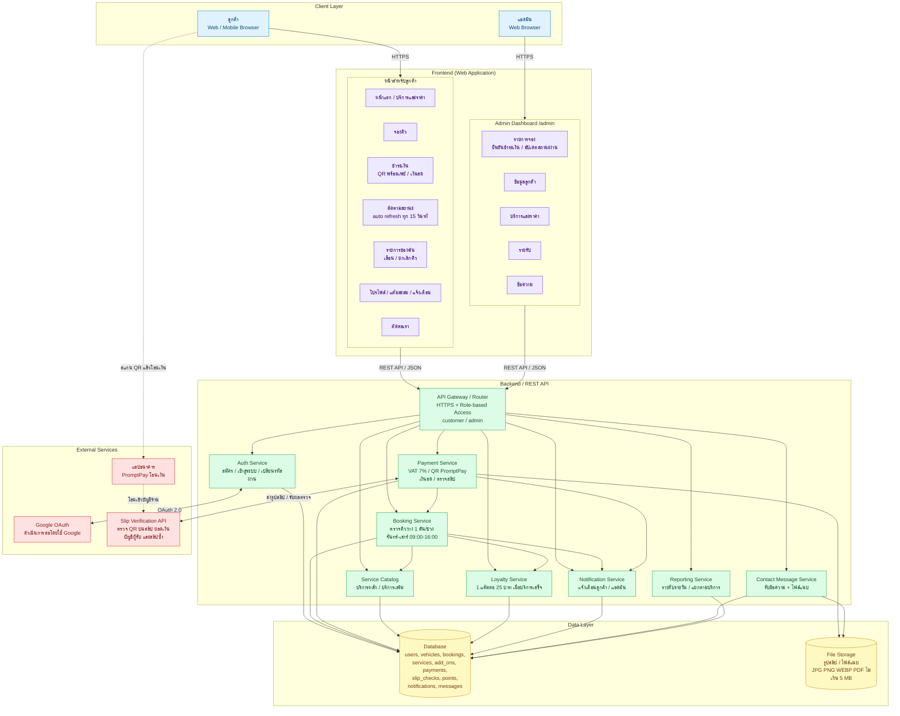

2) โครงสร้างของระบบ (System Architecture)

```mermaid
flowchart TB
    %% ===== Client =====
    subgraph CLIENT["Client Layer"]
        direction LR
        C1["ลูกค้า<br/>Web / Mobile Browser"]
        C2["แอดมิน<br/>Web Browser"]
    end

    %% ===== Frontend =====
    subgraph FE["Frontend (Web Application)"]
        direction TB
        subgraph FE_C["หน้าสำหรับลูกค้า"]
            F1["หน้าแรก / บริการและราคา"]
            F2["จองคิว"]
            F3["ชำระเงิน<br/>QR พร้อมเพย์ / เงินสด"]
            F4["ติดตามสถานะ<br/>auto refresh ทุก 15 วินาที"]
            F5["รายการของฉัน<br/>เลื่อน / ยกเลิกคิว"]
            F6["โปรไฟล์ / แต้มสะสม / แจ้งเตือน"]
            F7["ติดต่อเรา"]
        end
        subgraph FE_A["Admin Dashboard /admin"]
            A1["รายการจอง<br/>ยืนยันชำระเงิน / อัปเดตสถานะงาน"]
            A2["ข้อมูลลูกค้า"]
            A3["บริการและราคา"]
            A4["รายรับ"]
            A5["ข้อความ"]
        end
    end

    %% ===== Backend =====
    subgraph BE["Backend / REST API"]
        direction TB
        GW["API Gateway / Router<br/>HTTPS + Role-based Access<br/>customer / admin"]
        AUTH["Auth Service<br/>สมัคร / เข้าสู่ระบบ / เปลี่ยนรหัสผ่าน"]
        BOOK["Booking Service<br/>ตรวจคิวว่าง 1 คัน/ช่วง<br/>จันทร์-เสาร์ 09:00-16:00"]
        PAY["Payment Service<br/>VAT 7% / QR PromptPay<br/>เงินสด / ตรวจสลิป"]
        CAT["Service Catalog<br/>บริการหลัก / บริการเสริม"]
        LOYAL["Loyalty Service<br/>1 แต้มต่อ 25 บาท เมื่อบริการเสร็จ"]
        NOTI["Notification Service<br/>แจ้งเตือนลูกค้า / แอดมิน"]
        MSG["Contact Message Service<br/>รับข้อความ + ไฟล์แนบ"]
        REP["Reporting Service<br/>รายรับรายวัน / แยกตามบริการ"]
    end

    %% ===== Data =====
    subgraph DATA["Data Layer"]
        DB[("Database<br/>users, vehicles, bookings,<br/>services, add_ons, payments,<br/>slip_checks, points,<br/>notifications, messages")]
        FS[("File Storage<br/>รูปสลิป / ไฟล์แนบ<br/>JPG PNG WEBP PDF ไม่เกิน 5 MB")]
    end

    %% ===== External =====
    subgraph EXT["External Services"]
        GOOGLE["Google OAuth<br/>ดำเนินการต่อโดยใช้ Google"]
        SLIP["Slip Verification API<br/>ตรวจ QR บนสลิป ยอดเงิน<br/>บัญชีผู้รับ และสลิปซ้ำ"]
        BANK["แอปธนาคาร<br/>PromptPay โอนเงิน"]
    end

    %% ===== Connections =====
    C1 -->|HTTPS| FE_C
    C2 -->|HTTPS| FE_A
    FE_C -->|REST API / JSON| GW
    FE_A -->|REST API / JSON| GW

    GW --> AUTH
    GW --> BOOK
    GW --> PAY
    GW --> CAT
    GW --> LOYAL
    GW --> NOTI
    GW --> MSG
    GW --> REP

    BOOK --> CAT
    BOOK --> NOTI
    PAY --> BOOK
    PAY --> NOTI
    BOOK --> LOYAL

    AUTH --> DB
    BOOK --> DB
    PAY --> DB
    CAT --> DB
    LOYAL --> DB
    NOTI --> DB
    MSG --> DB
    REP --> DB

    PAY --> FS
    MSG --> FS

    AUTH <-->|OAuth 2.0| GOOGLE
    PAY <-->|ส่งรูปสลิป / รับผลตรวจ| SLIP
    C1 -.->|สแกน QR แล้วโอนเงิน| BANK
    BANK -.->|โอนเข้าบัญชีร้าน| SLIP

    classDef client fill:#e0f2fe,stroke:#0284c7,color:#0c4a6e
    classDef fe fill:#ede9fe,stroke:#7c3aed,color:#3b0764
    classDef be fill:#dcfce7,stroke:#16a34a,color:#14532d
    classDef data fill:#fef9c3,stroke:#ca8a04,color:#713f12
    classDef ext fill:#fee2e2,stroke:#dc2626,color:#7f1d1d
    class C1,C2 client
    class F1,F2,F3,F4,F5,F6,F7,A1,A2,A3,A4,A5 fe
    class GW,AUTH,BOOK,PAY,CAT,LOYAL,NOTI,MSG,REP be
    class DB,FS data
    class GOOGLE,SLIP,BANK ext
```
